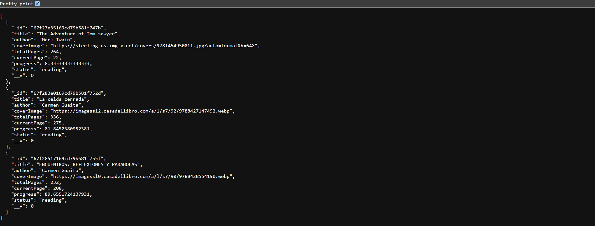

# 📚 Reading Tracker App

A minimalist **book tracking app** that lets users log books, track progress, and mark them as completed. Inspired by **Goodreads** but with a **cleaner and more modern design**.

## 🚀 Features

✅ Add books to "Reading" and "Completed" sections 📖  
✅ Track reading progress with **dynamic progress bars** 📊  
✅ Beautiful **3D hover effects on book covers** 🎨 
✅ Responsive **and mobile-friendly** design 📱

## 🛠️ Tech Stack

- **Frontend:** React, CSS
- **Backend:** Node.js, Express
- **Database:** MongoDB

## 👁️ Screenshots

### Frontend

<p>
  
</p>

<p>
  
</p>

<p>
  
</p>

### API Rest 🗞️

<p>
  
</p>

## 📦 Installation

1. Clone this repository:

```bash
  git clone https://github.com/Espadv69/BookWiseTracker.git
```

2. Navigate to the project folder:

```bash
  cd BookWiseTracker
```

3. Navigate to frontend folder and install dependencies:

```bash
  cd frontend
  npm install
```

4. Start the frontend:

```bash
  npm run dev
```

5. Navigate to backend and install dependencies:

```bash
  cd backend
  npm install express mongoose cors dotenv
```

6. Start the backend:

```bash
  node server.js
```

## 🔧 Environment Variables

Create a `.env` file in the backend directory and add the following:

```env
MONGO_URI=your_mongodb_connection_string
PORT=5000
```

## 📜 API Routes

| Method | Endpoint     | Description       |
| ------ | ------------ | ----------------- |
| GET    | `/books`     | Get all books     |
| POST   | `/books`     | Create a new book |
| PUT    | `/books/:id` | Update a book     |
| DELETE | `/books/:id` | Delete a book     |

## 🎨 UI Inspiration

The app has a modern and clean look, inspired by Goodreads but with a simpler and more beautiful design:

- 📌 Large book covers with smooth hover effects
- 📌 Dynamic progress bars for tracking reading progress
- 📌 Minimalist color palette for a great reading experience

## 🤝 Contributing

Feel free to submit issues or pull requests to improve this project.

## 📄 License

This project is licensed under the **[MIT License](https://opensource.org/license/mit)**.

---

Made with ❤️ by Espadv69
